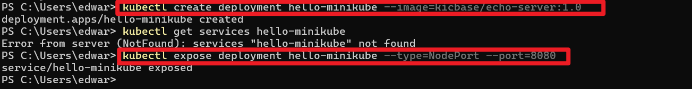
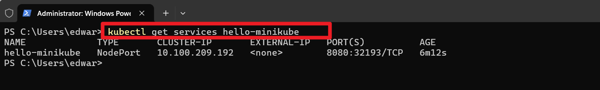
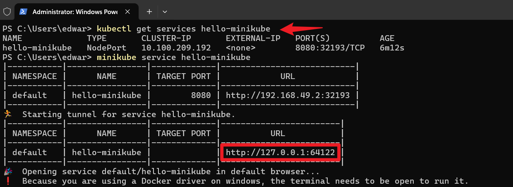
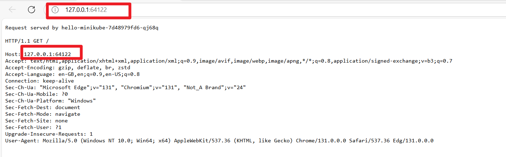
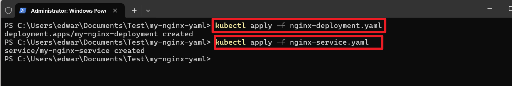
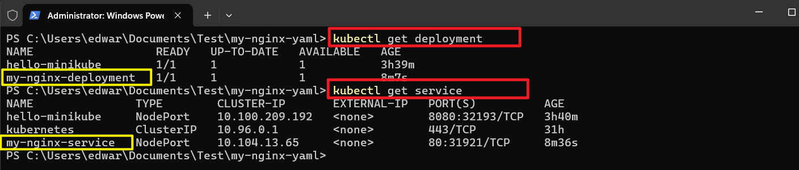
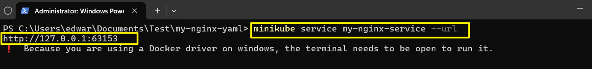
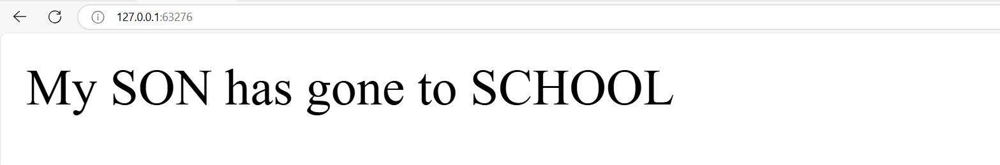

# Working With Kubernetes Resources

## Introduction to YAML

A Kubernetes YAML file is used to define the configuration of Kubernetes objects, such as Pods, Services, and Deployments. It specifies the desired state of these objects, including container images, resource allocations, and networking details. This declarative approach allows Kubernetes to manage and maintain the application's desired state automatically.

## Basic Structure Of YAML File

YAML uses indentation to represent the hierachy of data, and it uses whitespace (usually spaces, not tabs) for identation.

    key1: value1
    key2:
      subkey1: subvalue1
      subkey2: subvalue2
    key3:
      - item1
      - item2

**Data Types**

 `SCalars` are single values

  Strings
  
    name: John Smith

  Numbers

    age: 28

  Booleans

    is_student: false

`Collections`

 List (arrays)

     fruits:
       - Grapes
       - Strawbery
       - orange
 
 Maps (Key-value pairs)

     person:
         name: Bob
         age: 27

`Nested Structure` YAML allows nesting of structures.

    employee:
        name: John Smith
        position: developer
        skills:
            - Python
            - JavaScript

`Comments` In YAML, comments starts with `#`

    # This is a comment
       key: value

`Multiline Strings` Multiline strings can be represented using the `|` or `>`

     description: |
        This is a multiline
        string in YAML.

`Anchors and Aliases` You can use `&` to create an anchor and `*` to create an alias.

    first: &name John
    second: *name
In this example, `second` has the same value as `first`

### Deploying Applications In Kubernetes

In kubernetes, deploying application is a skill that every learner needs to grasp. Deployment involves the process of taking your application code and running it on kubernetes cluster while ensuring it scales,manages resource efficiently and its resilient.

### Deployments in Kubernetes

In kubernetes, a deployment is a declarative specification for running applications. It enables you to describe the desired state of your application and Kubernetes ensures that the current state matches this desired state.Deployment are the cornerstone for maintaining application consistency and availability.

### Services in Kubernetes

Once your application is deployed,it needs a way to be accessed by other part of the system or external users.This is where SERVICES come into play.In kubernetes a service is an abstraction that defines a logical set of Pods and a policy by which to access them.It acts as a stable endpoint to connect to your application allowing for easy communication within the cluster and from external sources.

### Types of Services inn Kubernetes

-ClusterIP:

* Default type.

* Exposes the service on a cluster-internal IP.

* Only accessible within the cluster.

-NodePort:

* Exposes the service on each node's IP at a static port.

* Makes the service accessible from outside the cluster using <NodeIP>:<NodePort>.

-LoadBalancer:

* Creates an external load balancer.

* Distributes traffic among the nodes.

* Often used in cloud environments to manage traffic.

-ExternalName:

* Maps the service to a DNS name.

* Allows you to route traffic to an external service.

### Deploying a Minikube Sample Application

Using YAML files for deployment and services in kubernetes is like crafting a detailed plan for your application, while direct deployment with `kubectl` command is more like giving a quick, on the spot instructions to launch and manage your application. Lets create a minikube deployment and service using `kubectl`.

    kubectl create deployment hello-minikube --image=kicbase/echo-server:1.0

The command above creates a kubernetes deployment named hello-minikube running the `kicbase/echo-server:1.0` container image.

    kubectl expose deployment hello-minikube --type=NodePort --port=8080
The command exposes the kubernetes deployment named ``hello-minikube`` as a NodePort service type on port 8080

    kubectl get services hello-minikube

This commands checks the status of services in your Minikube cluster

The easiest way to access this services is to allow minikube to launch a web browser for you.

    kubectl get services hello-minikube

 

## Working With YAML Files.

1 Create a folder named `my-nginx-yaml`

2 Create a file named `nginx-deployment.yaml` and paste the content into the file

    apiVersion: apps/v1

    kind: Deployment

    metadata:

    name: my-nginx-deployment

    spec:
        replicas: 1
        selector:
            matchLabels:
            app: my-nginx
        template:
            metadata:
                labels:
                  app: my-nginx
            spec:
                containers:
                - name: my-nginx
                  image: dareyregistry/my-nginx:1.0
                  ports:
                  - containerPort: 80

The YAML snippet above defines a kubernetes Deployment for deploying an instance of Nginx web server.

Lets break down the key components.

### Components Breakdown

`apiVersion`: Specifies the version of the Kubernetes API that you’re using. In this case, it's apps/v1, indicating you're using the apps API group, version 1.

`kind`: Defines the type of Kubernetes object you are creating. Here, it’s Deployment, which is used to manage a set of identical pods to ensure they run correctly and can be updated.

`metadata`: Contains metadata about the object.

`name`: The name of the Deployment, which is my-nginx-deployment.

`spec`: Describes the desired state of the object.

`replicas`: Specifies the number of pod replicas to run. In this case, 1.

`selector`: Defines how to select pods.

`matchLabels`: Identifies the pods to manage with app: my-nginx.

`template`: Describes the pods that will be created.

`metadata`: Labels for the pods.

`labels`: Key-value pairs to categorize the pod (app: my-nginx).

`spec`: Specifies the pod's container settings.

`containers`: List of containers to run.

`name`: The name of the container, which is my-nginx.

`image`: The container image to use (dareyregistry/my-nginx:1.0).

`ports`: List of ports to expose from the container.

`containerPort`: The port number that the container listens on, which is 80.

3 Create a file named `nginx-service.yaml`

    apiVersion: v1
    kind: Service
    metadata:
     name: my-nginx-service
    spec:
      selector:
        app: my-nginx
      ports:
        - protocol: TCP
          port: 80
          targetPort: 80
      type: NodePort
The provided YAML snippet defines a kubernetes Service for exposing the nginx application to the external world.

**apiVersion: v1** 
 - This specifies the API version you're using to create this resource. Here, v1 is the stable version for Service.

**kind: Service** 
- This defines the type of resource you're creating. In this case, it's a Service.

**metadata** 
- This section contains metadata about the resource, such as its name.
  * `name: my-nginx-service`: This is the name of your service. It should be unique within the namespace.

**spec** 
- This section specifies the behavior and characteristics of the Service.

  * **selector** 
    * This field is used to select the pods that will be targeted by the Service.

    * app: my-nginx: This means the Service will target pods that have the label app: my-nginx.

  * ports

    - This defines the list of ports that the service will expose.

    - protocol: TCP: Specifies the protocol to use. In this case, it's TCP.

    - port: 80: The port that the Service will expose to the external world.

    - targetPort: 80: The port on the container to which the Service will forward traffic.

* **type: NodePort**

   - This type exposes the Service on each Node’s IP at a static port. The NodePort service will allocate a port from a range (usually 30000–32767) to expose the Service on all nodes in the cluster.
 
 4  Run the command below for the deployment on the cluster

    kubectl apply -f nginx-deployment.yaml
    kubectl apply -f nginx-service.yaml

5 Verify your deployment

        kubectl get deployments

        kubectl get services

6 Access your deployment on web browser

    minikube service my-nginx-service --url
 
 

 